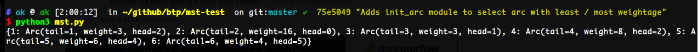
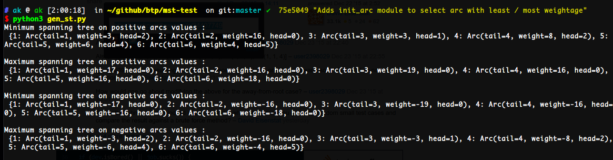

### `mst.py` (Minimum Spanning Tree)

This script has been given in one of the [Stack-Overflow answers](http://stackoverflow.com/a/34407749) regarding Admund's Algorithm for finding Minimum Spanning Tree (MST) on a Directed Graph. 

### `gen_st.py` (general Spanning Tree)

I have tweaked the above `mst.py` to work as both minimum / maximum spanning tree(s) - depending on the argument given to the function, along with a few code refinements.

